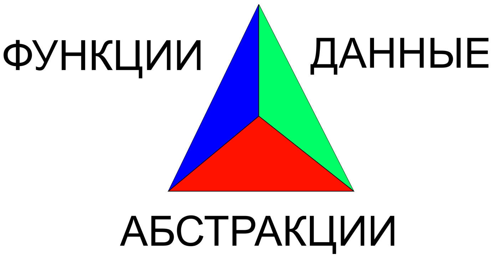

# Введение в ФП

### Введение во введение.
Сначала поговорим о том, с чего любят начинать разговор о функциональном программировании. 
Поговорим об истории программирования как такового. 
Спонтанное программирование нас интересовать не будет, так как само по себе оно не является подходом.

После этого началась эпоха структурного программирования. 
Разрабатывались алгоритмы, разрабатывались структуры данных. Решаемые задачи разбивались на подзадачи, подзадачи в конце
концов реализовывались в отдельных функциях и "всё было хорошо".

А потом пришли "страшные люди", которые сказали, что все программы состоят из классов, ООП - для всех, 
что писать код теперь нужно только такими методами. И "всё стало очень плохо". (В основном, в этом винят наследование,
но в принципе там много чего можно сказать)

"Но есть спасение и имя ему ФП!"

После чего рисуется приблизительно вот такая... Или, впрочем, любая другая, никакого смысла не имеющая картинка.

А на самом деле, как это обычно бывает, жизнь куда сложнее того, что можно изобразить на одной, даже самой хорошей 
картинке

### А как?..

